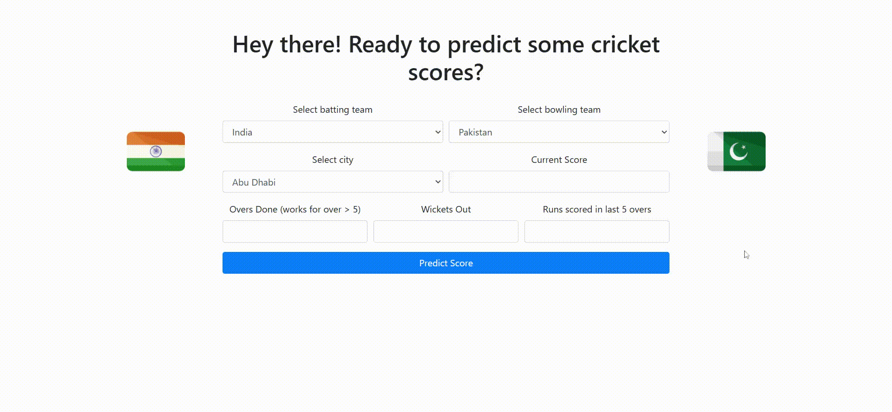

**ScoreCast – Cricket Score Prediction**

A Flask-based web application that predicts the final T20 cricket score of a batting team given the current match situation, built with Python, scikit-learn, XGBoost, and deployed via Flask.

## Demo



---

## Features

- Select batting team, bowling team, and venue (city) via dropdowns.
- Input current score, overs completed (e.g., `18.2` for 18 overs and 2 balls), wickets fallen, and runs scored in the last 5 overs.
- Dynamic country flags update when teams are selected.
- Real-time prediction of final team score using a trained XGBoost regression model.

---

## Technology Stack

- **Backend**: Python 3.x, Flask
- **Data Processing & ML**: Pandas, NumPy, scikit-learn, XGBoost
- **Templating**: Jinja2 (Flask)
- **Model Persistence**: `pickle`
- **Frontend**: HTML, CSS, JavaScript

---

## Dataset

- **Source**: Collected ball-by-ball data from T20 international matches (post-2021 World Cup up to 2024 venues).
- **File**: `T20_iore_info.csv`
- **Columns**:
  - `match_id`: Unique identifier
  - `batting_team`, `bowling_team`: Team names
  - `ball`: Over.ball format (e.g., `5.3`)
  - `runs`: Runs scored on that delivery
  - `player_dismissed`: Dismissal info (if any)
  - `city`: Venue city (missing for some rows)

---

## Feature Engineering

1. **City Imputation & Filtering**: Fill missing `city` values by extracting from `venue`, then keep cities with ≥600 match entries.
2. **Current Score**: Cumulative sum of `runs` grouped by `match_id`.
3. **Balls Left**: From `ball` parse overs and balls; compute `balls_left = 120 - (overs_completed*6 + balls_in_over)`.
4. **Wickets Left**: Cumulative count of dismissals; then `wickets_left = 10 - wickets_fallen`.
5. **Current Run Rate**: `current_run_rate = (current_score * 6) / balls_bowled`.
6. **Last 5 Overs Runs**: Rolling sum over last 30 balls per match.
7. **Final Runs**: Total runs per match as the target variable.

Final features:
```
[batting_team, bowling_team, city,
 current_score, balls_left, wickets_left,
 current_run_rate, last_five]
```
Target: `final_score` (total runs).

---

## Model Training

- **Train/Test Split**: 80% train, 20% test (`random_state=42`).
- **Pipeline**:
  1. **ColumnTransformer**:
     - OneHotEncode: `batting_team`, `bowling_team`, `city`
     - Passthrough numeric features
  2. **StandardScaler** for numeric columns
  3. **XGBoostRegressor** with:
     - `n_estimators=1000`
     - `learning_rate=0.2`
     - `max_depth=12`
     - `random_state=1`
- **Evaluation**:
  - **R² Score**: ~0.98
  - **Mean Absolute Error**: ~1.7 runs
- **Artifact**: Serialized pipeline saved to `pipeline.pkl` via `pickle`.

---

## Installation

1. **Clone the repository**:
   ```bash
   git clone https://github.com/namaniisc/ScoreCast.git
   cd ScoreCast
   ```

2. **Create a virtual environment & activate**:
   ```bash
   python3 -m venv venv
   source venv/bin/activate
   ```

3. **Install dependencies**:
   ```bash
   pip install -r requirements.txt
   ```

4. **Ensure dataset and model**:
   - `T20_iore_info.csv` in project root
   - `pipeline.pkl` in project root

---

## Usage

1. **Run the Flask app**:
   ```bash
   python app.py
   ```

2. **Access in browser**:
   Navigate to `http://localhost:5000`.

3. **Make Predictions**:
   - Select teams and city.
   - Enter current match stats.
   - Click **Predict Score** to see the forecast.

---

## Project Structure

```
cricket-score-predictor/
├── app.py               # Flask application
├── pipeline.pkl         # Serialized ML pipeline
├── T20_iore_info.csv    # Raw dataset
├── models/              # (Optional) model artifacts
├── notebooks/           # Jupyter notebooks
│   └── train_model.ipynb
├── requirements.txt     # Python dependencies
├── static/
│   └── images/          # Team flag images
└── templates/
    └── index.html       # Frontend template
```

---

## Future Improvements

- Integrate real-time data APIs (e.g., Cricbuzz) for live inputs.
- Experiment with advanced architectures (LSTM sequences, ensemble methods).
- Add confidence intervals to predictions.
- Dockerize for containerized deployment.

---

## Contributing

Contributions are welcome! Please:
1. Fork the repo
2. Create a feature branch (`git checkout -b feature/YourFeature`)
3. Commit your changes (`git commit -m 'Add some feature'`)
4. Push to branch (`git push origin feature/YourFeature`)
5. Open a Pull Request


